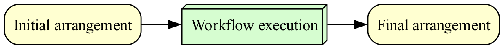

#  TRO Report

## TRO Information
| Property     | Value | 
| --------     | ----- | 
| Name         | FRED API Example |
| Description  | Analysis and visualization of S&P500 data using FRED API. S&P 500 data is copyrighted and redistribution is not permitted without permission. The analysis requires use of a private FRED API key that cannot be redistributed. |
| Created by   | Craig Willis |
| Created date | 2024-02-20 |

## TRACE System Information

This TRO was generated by the following TRACE System:

| Property     | Value | 
| --------     | ----- | 
| Name         |  |
| Description  | TRACE System Reference Implementation |
| Owner        | TRACE Project |
| Contact      | trace@trace-poc.xyz |
| URL          | https://server.trace-poc.xyz |

Show Public Key

-----BEGIN PGP PUBLIC KEY BLOCK-----

mQGNBGXiBGYBDAC1zL1lg4XBaynZAYosa7VPUGY9BNa7AH6PeIY66Ua4A814NLmB
xZcMYlLSeHgxYFV7Dn1j+v5LW6sUsXZVOJ9Mvbyb7AXFgvfbyYC6M4CT/macMbzE
TWG9Yn5B526euZoaOsaiiTGN+kRL56zvqjIU7f25BcNf/A/l71QJGyzU783e2vFV
Eio0ePrVP8cmN8BPbO6bLNak+32emPaXjHrZH1zzGSyX65VAA36Vjjp+GFqP0IMi
Y2i+FvDv61Me7VUzQVfiY6MeAqHQgNZWP5UuKPK1f5BDMPd45wOSAUDogqsw95Pd
bxlqqiFLYX/Tpv3RY0h4oNHDR1ii+XWVpHjTDXTWNgwnLYfT+uQlzuNfzbuIJFn4
WK0Y4n7nYgNa2M0aOLPGA5dTq8hvK6bQXWO3wtEowAdPFKnXONaBCCIzf+lj7USa
rWZAz7tgznPIxTpMXk3JJCYKF2wqdX2rutMT+Bi17ZFTT/0IkWoQslwdkfogHbiP
LO8P/WbvUdMChLUAEQEAAbQfVFJBQ0UgUE9DIDx0cmFjZS1wb2NAZ21haWwuY29t
PokB1AQTAQoAPhYhBPvrqhF3MBM21PWtc9VZZpyP2L7uBQJl4gRmAhsDBQkDwmcA
BQsJCAcCBhUKCQgLAgQWAgMBAh4BAheAAAoJENVZZpyP2L7uGp0MAJzooLCnmmad
XVYyXESltGWbQNMa7uwiSKiC3PiAr4I0yxFfm3USnY7Ls7UQaRSPkwgM/MF/BnJz
NAqgCC8mTKg+OHOaalCIJYvxDPySrnG4Y8xQ58cLL/hTMRIOR4Y7JyC6x9LOp4jS
EoZyhevOTzOIHZ/bROCTRDPjK0mypnD2EalqTUFTge5WXmAtmyQm0tbsGI3mAhrt
orX15g3wgR0Jb+IeFyxV15qvDE6wy7ZdSsDwtorFEW30IJ111SAT65BjtdMVGk8O
F1VQSEjPwOl43OmxjlzaHLMVsu25ToEoK3Lm+1EFX6jyDYQOctsd0HOMLpQhDdFI
7Teen3HDrPAxhA2NbtFLIab5x/yrmmUnW8FdLMc/fpFyJ5wswcgNlGgrmGwpu+O0
QxQ0YIidsllSnpUQadqzejknO8P6rK31759ufgicO4arYmPtgIHnMT8OKvdIKlBJ
7fX4U+SgtiAIHWZnSIvaEq8litLnJj/zwysHZoa0WgQx/Cq1NUKMc7kBjQRl4gRm
AQwAvturXc9Qv0/Ac+1wiPtPiL20Vh2zmKKArmmLUBfeNe/tTqHhbxdEnIM2YfEy
ZoEkOn/DpwdumzHMPs9u3rueNPIyjtRqMXKFUPl+neHM94x37bGiIxRZwhsyvUCM
YL+R235wI+kV7H1dFIT8NTPm06a7+KrIM0lGs5Jh5A0RVpnJicNCYU7iELP5jH9b
kqGjxOoK7OWMqJCl49uSVqwHlS5F6YuUJC2auv2EPwWbhI6ZESI+ui9HqK1XKi3u
6hZlfAzt0/sRkk6BFXNZc3Jmb2RWv8SSyfo/EggwXpdQdgliIw49srmy2NE9QT+2
8TvizCacIYjdQJQgC8xMBfwWKTd+NYnztdG4ThWET4IljrSq0U+qOvjZhD3Y771l
uOOjRgoXaQ/ywBdMCQ4tFlcVPVhKqB52HqTMQqMOPon7oCaJiNjgGhw3uT/6TFIl
vzb1bHykKgXLA2ErBHr8qlewbC8hd65HyybPMMmMUzrPrStdYU3Jcz4EqfwBq+Oy
u+mZABEBAAGJAbwEGAEKACYWIQT766oRdzATNtT1rXPVWWacj9i+7gUCZeIEZgIb
DAUJA8JnAAAKCRDVWWacj9i+7mY7DAC0MGEt/93eGiO9yG8tVe3xBCzJf6NlSj25
NQ3AxZE1TcwPrKkuSttEo52ZlXbh53Wc3Im2WdZCrE4VSek9dOi50p5owR16WyGc
dDTP0Pku5heRCSsA6YazymLiBjBqulRE/Fxw02IsPzTZxgIphxnHkrM2EUMmOm15
SqykNzToKuMuXaFXaCpGd2VtYhhr1HN1odwpcrbJlthT/AUv0etunyNsNsuVNQpe
6e/jqKsfN4/bxJP0sMk0qRRgvGbgimwu810cjEgW1EnP3YFn5VAmIgbViRBJKLpW
4bY7L7qmhSvHqYtKrqVn1yksdRk6S5rJAJhrQu/tlxZQNLdAV4CBD7NtRSv8Fhdi
Fcrin+TiER15VogM/LD/Z7DiE0Zx3s3hb7RKMUnxVsBd8w+8P317saSXYX7xfIXa
JmQxsFNfTEnixHNyS+J/w3jdNxxwe2N2l9ITgFSd+O5ouAP44AjzyPwC3SAe/ugi
qENJJGwGwcdqqm1qfGuYYihO0MurIMY=
=Qp7y
-----END PGP PUBLIC KEY BLOCK-----

### Capabilities
| Capability  | Description  | 
| ----------- | ------------ |
| CanProvideInternetIsolation | System can disable network access during workflow execution. |

## Trusted Research Performances

A Trusted Research Performance (TRP) captures the execution of a process in the context of a TRACE system. Typically, a TRP would take as input one or more sets of files (input arrangements) and produce another set of files (output arrangements).

| Description  | Accessed     |  Contributed     |  
| -----------  | ------------ |  ------------ |
| Workflow execution | Initial arrangement | Final arrangement  |

## Arrangements

Arrangements define how artifacts, typically files, are organized before and after each TRP. Artifacts are defined by their location and a checksum of their contents. Artifacts may be local or remote, defined by an URI. They may be included or excluded from the associated archive.
### Initial arrangement
| Artifact | SHA-256  | Status |
| -------- | -------- | ------ |
| .dockerignore | 35b06fd85ed2da00cd31c90619cf6... |  |
| .gitignore | 8f9d1a1c8180ac4c53458437d88ff... |  |
| fred_apikey.txt | 5157474cd090e9b09c9cc4a29134c... |  |
| requirements.txt | 79056c6a6c4bf5c13958768148cbc... |  |
| run.sh | c38107430682ca6466f61421f40aa... |  |
| scripts/fred.py | 25f9160f2bd6fb2049775e75f710d... |  |
| trace.json | 79d0ab04e05caa08a1df2092c9e42... |  |
### Final arrangement
| Artifact | SHA-256  | Status |
| -------- | -------- | ------ |
| .docker_stats | a101a083f8b39935dd64af9f3ec0c... | Added |
| .dockerignore | 35b06fd85ed2da00cd31c90619cf6... | Unchanged |
| .entrypoint | d31ce0453051853c17ba2a5225b3d... | Added |
| .gitignore | 8f9d1a1c8180ac4c53458437d88ff... | Unchanged |
| .stdout | e3b0c44298fc1c149afbf4c8996fb... | Added |
| ~~data/sp500.csv~~ | 6e69b0bb10277374181f0db85645b... | Excluded due to License |
| ~~data/sp500.json~~ | 6c8a7f95f6983118bae3990adb3f2... | Excluded due to License |
| ~~fred_apikey.txt~~ | 5157474cd090e9b09c9cc4a29134c... | Excluded due to Private |
| requirements.txt | 79056c6a6c4bf5c13958768148cbc... | Unchanged |
| results/sp500.png | a2e7e801f4790a3cfb843869e9fcb... | Added |
| run.sh | c38107430682ca6466f61421f40aa... | Unchanged |
| scripts/fred.py | 25f9160f2bd6fb2049775e75f710d... | Unchanged |
| trace.json | 79d0ab04e05caa08a1df2092c9e42... | Unchanged |

